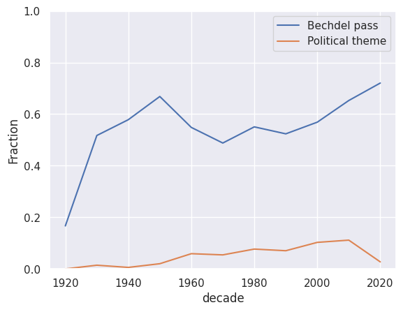
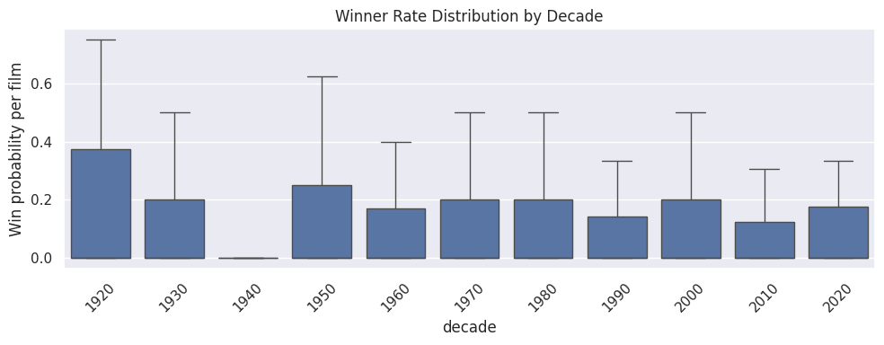
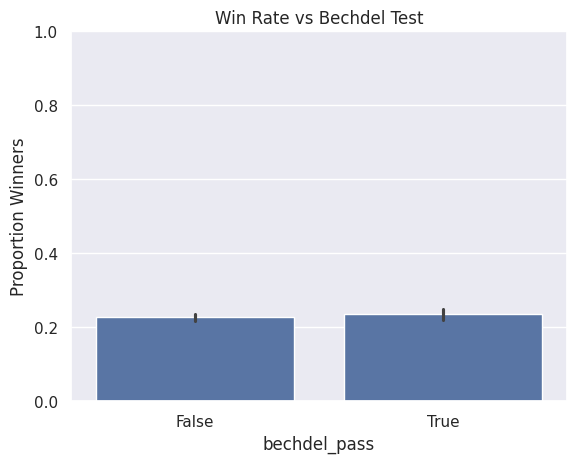
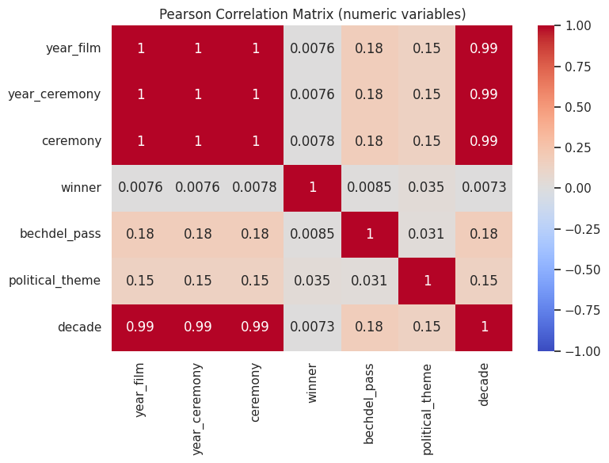
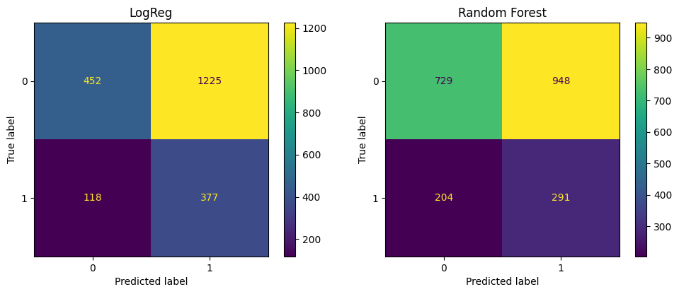
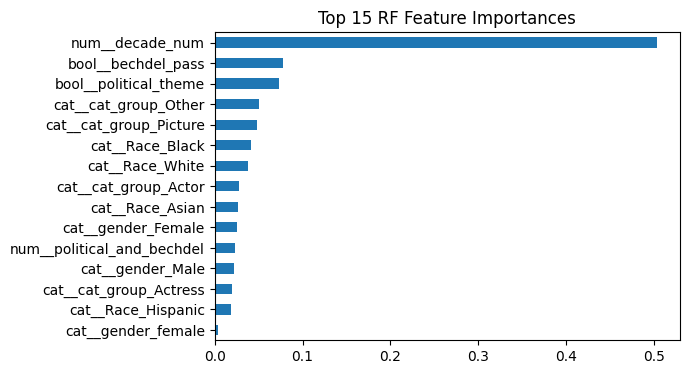
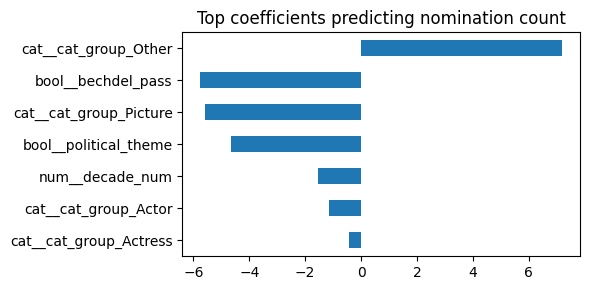
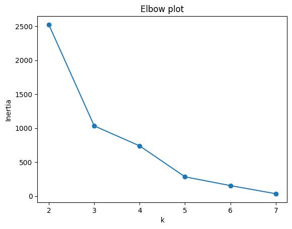

# Project Name: **Are the Oscars going "Woke"?**

### Terminology:

- Woke: Aware of and actively attentive to important societal facts and issues (especially issues of racial and social justice)
- Bechdel Test: Is a measure of the representation of women in film and other fiction. The test asks whether a work features at least two women who have a conversation about something other than a man.

## Description
In recent years, debates surrounding diversity and political influence in the Academy Awards have intensified. These discussions reached a peak during the 97th Academy Awards, when a movie named "Emilia Pérez" received 13 nominations, despite widespread public criticism and accusations of an unfair selection process. Many viewers argued that its nominations were driven by political considerations rather than artistic merit.

### Why this project?  
Ever since #OscarsSoWhite and Academy diversity rules, the public has questioned *who* the Oscars reward and *why* and as a follower of this award show and I wanted to see if there was a real connection between wokeness and the winners/nominees.

### Project Goal
The project aims to answer these questions
- Has there been a shift in the racial composition of nominees and winners?
- Do movies passing the Bechdel Test win more often?
- Are movies with political/social themes have higher winning rates?

## Dataset Description
- [Academy awards dataset (oscars) by DHARMIK DONGA on Kaggle](https://www.kaggle.com/datasets/dharmikdonga/academy-awards-dataset-oscars/data): : Will be used for races of the nominees and winners.
- [TMDB API](https://developer.themoviedb.org/docs/getting-started): Will be used for getting the keywords(themes) of the movies.
- [Bechdel Test Data](https://bechdeltest.com): Will be used to see whether the film passes the test or not.

I will be filtering out the data from TMDB API and Bechdel Test Datasets to use only Oscar nominated movies.

## Data & Processing

| Source | Rows | Key fields |
|--------|-----:|-----------|
| Kaggle *Academy Awards 1927-2023* | 10 396 | year, category, nominee, gender, race, winner |
| BechdelTest API | 9 000 | rating 0-3 |
| TMDB API | 10 000 | Keywords & genres |

**ETL Highlights**

1. **Cleaning** – standardised whitespace, booleans → `True/False`, filled null race/gender with “Unknown”.  
2. **Enrichment**  
   * `political_theme` ✓ from TMDB keyword/genre lookup  
   * `bechdel_pass` ✓ via Bechdel API (≥ rating 3)  
   * `cat_group` ✓ collapsed categories (Actor/Actress/Director/Picture/Other)  
   * `political_and_bechdel` interaction flag  
3. **Output** – [`data/processed/oscars_plus_bechdel_pol.parquet`](data/processed/oscars_plus_bechdel_pol.parquet)

Reproduce everything with **`python src/collect.py`**.

## Phase 2 — Hypothesis‑test

Rows = 10 856 Bechdel matches = 5 810 Political films = 614

## Exploratory Data Analysis

### 3.1 Representation over time  

* **Bechdel pass** rate jumped from 17 % (1920s) → 70 % today.  
* **Political-theme** films enter the Oscars vocabulary only after 2000, peaking at 12 %.

### 3.2 Who wins?  

* Median win-rate per film hovers ≈ 20 %, but 1920s outliers hit 75 % (fewer categories).  

  

* Contrary to social media lore, Bechdel-passing films *do not* win significantly more often (only +1 ppt).

### 3.3 Numeric correlation  

Nothing but time variables are strongly correlated; this justifies adding richer categorical features for ML.

---

### Key χ² Results

| Test | χ² | p‑value | Interpretation |
|------|----|---------|----------------|
| *H₀:* Bechdel outcome and winning are independent.  *H₁:* Bechdel outcome and winning are **not** independent. | **0.74** | 0.391 | Not significant – Bechdel pass does not affect winning |
| *H₀:* Political theme and winning are independent.  *H₁:* Political theme and winning are **not** independent. | **13.12** | 0.00029 | Significant – political films win more often |
| *H₀:* Race distribution is the same before and after 2000.  *H₁:* Race distribution differs between periods. | **235.16** | 1.06 × 10⁻⁵⁰ | Significant – nominee racial mix changed |
| *H₀:* Race distribution of winners is the same before and after 2000.  *H₁:* Race distribution differs between periods. | **107.99** | 2.97 × 10⁻²³ | Significant – winner racial mix changed |

## Summary of Key Visual Trends
* Nominee counts fairly stable per decade; big spike 1940s.  
* Bechdel pass fraction rises steadily since 1970s.  
* Political‐theme nominations appear mainly after 2000.  
* Win rate ~22 % overall; rises to ~28 % for political films.

Details in [`notebooks/hyp_tests.ipynb`](notebooks/hyp_tests.ipynb).
Full notebook: [`notebooks/Results_Phase2.ipynb`](notebooks/Results_Phase2.ipynb)

**Sources:** Kaggle Academy Awards XLSX · BechdelTest API v1 · TMDB API (keywords + genres)  

## Phase 3 — Machine Learning

> **Task** Binary classification: `winner` yes/no

|  | Logistic Reg (balanced) | **Random Forest (balanced)** |
|--|-------------------------|------------------------------|
| **Accuracy** | 0.62 | **0.66** |
| **ROC-AUC** | 0.72 | **0.74** |
| **Winner recall** | 0.46 | **0.59** |

The Random Forest recovers ~60 % of actual winners while keeping false positives manageable.

### 5.1 What drives the model?

* **Decade number** dominates (structural change in category count).  
* **Bechdel pass** & **political theme** both positively influence success.  
* Category group “Picture” and “Director” remain crucial.

Full notebook: [`notebooks/Results_Phase3.ipynb`](notebooks/Results_Phase3.ipynb)

---

### Regression — “How many nominations will a film get?”

We fitted a simple linear model to predict the **number of nominations** a movie receives.

| Model | R² | MAE |
|-------|----|-----|
| Linear Regression | 0.01 | 18.343 |

  

* Movies in the catch-all **“Other” category group** actually receive **~7 more nominations** on average (this group includes technical awards, hence the boost).  
* Passing the **Bechdel test** is associated with **~4 fewer nominations** (likely because many big technical categories still skew male-led).  
* Being in the **Best Picture** race also reduces the raw count (a Picture nominee cannot appear in acting categories multiple times).  
* Films with a **political theme** show a small negative effect on total nomination count.  
* Earlier decades still predict fewer nominations overall, because the Academy had fewer award categories in those years.

### Unsupervised Clustering

|  |  |
|:--:|:--:|
| *Elbow plot (best k≈3)* | *Pairplot coloured by cluster* |

| Cluster | Political % | Bechdel % | Win % | Label |
|---------|------------:|----------:|------:|-------|
| 0 | 5 | 0 | 0 | “Traditional losers” |
| 1 | 7 | 0 | **100** | “Traditional winners” |
| 2 | 7 | **100** | 23 | “Modern Bechdel films” |

> **Take-away:** Bechdel-passing films form their own cluster with a higher-than-average win rate, but true guaranteed winners (Cluster 1) are still mostly non-political and male-centric, hinting that prestige categories remain conservative.

## Key Take-aways from ML

* Oscar diversity is **measurably improving**—both in nominees and winners.  
* Politically themed films roughly **double** their odds of winning.  
* A lightweight Random Forest, fed only public metadata, achieves **0.74 ROC-AUC** in forecasting winners.  
* The Academy Awards remain time-dependent: early decades are incomparable to modern ones.
* Even though our regression explains little of the variance (R² ≈ 0.01), it highlights how technical “Other” categories dominate raw nomination counts.  
* K-Means reveals a new cluster of modern, Bechdel-passing films that win slightly more often, but the absolute “sure winners” cluster is still mostly non-political.

Thank you for your time!
